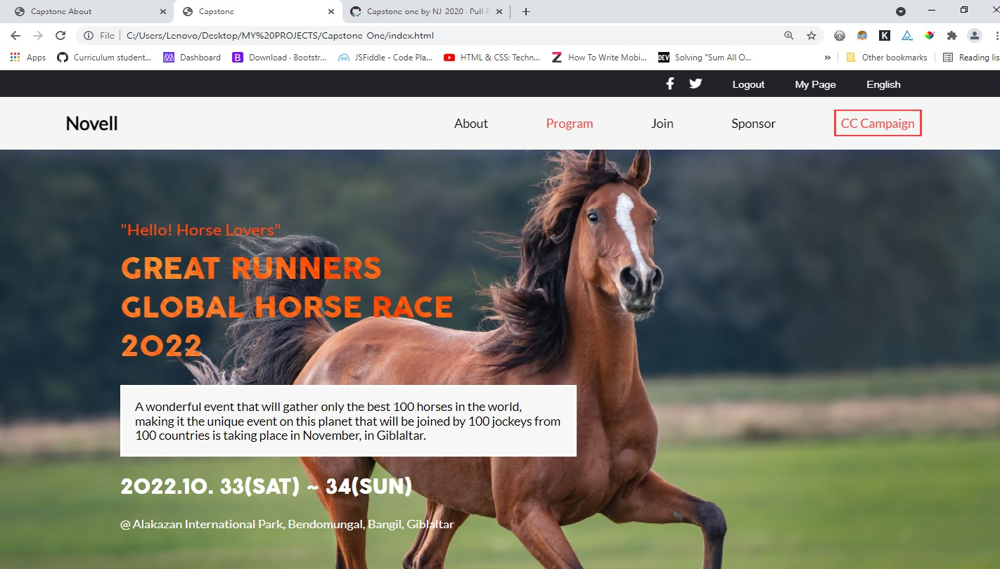

# Project: Capstone One

> This project is a Capstone project.  It covers html, css, javascript and applying linters on each of them.  It is to demostrate my ability to create UIs adaptable to different screen sizes using media queries.



New additions:

* Solo programming that covers: 
- Use JavaScript to manipulate DOM elements and use JavaScript events.
- Use objects to store and access data.
- Use Flexbox to place elements in the page.
- Use CSS selectors correctly.

## Built With

- Html + Css + Js

## Live Demo Of The Project

https://nj-2020.github.io/Capstone-One/

### Usage

This is used for learning purposes. Feel free to collaborate.

### Run tests

To locally run tests using html and css linters.

Use:

For HTML:
```
npx hint .
```

For CSS:
```
npx stylelint "**/*.{css,scss}" 
```
### Deployment

Make a pull request if you want to contribute. Thanks.

## Authors

👤 **Novell (NJ-2020)**

- GitHub: [NJ](https://github.com/NJ-2020)

👤 ****

- GitHub: []()

## 🤝 Contributing

Contributions, issues, and feature requests are welcome!

## Show your support

## Acknowledgments:
This project does not potrait the real life.  It is only for learning purpose.  I clone this project from a web designed by Cindy Shin in Behance.  Hence, all credit should be given to him.

Please. Give a ⭐️ if you like this project!
